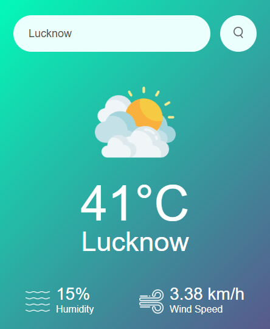

# Weather App

This is a simple Weather App that allows users to search for the current weather conditions of any city. The app fetches real-time weather data using the [OpenWeather API](https://openweathermap.org/api) and displays information such as temperature, humidity, wind speed, and weather conditions.

## Features

- Search for weather by city name.
- Displays:
  - Current temperature in Celsius.
  - Humidity percentage.
  - Wind speed in km/h.
  - Weather condition with an appropriate icon.
- Error handling for invalid city names.
- Loading indicator while fetching data.

## How It Works

1. The user enters a city name in the search bar and clicks the search button or presses the Enter key.
2. The app sends a request to the OpenWeather API with the city name and API key.
3. The API responds with weather data, which is then displayed on the screen.
4. If the city name is invalid, an error message is shown.

## Technologies Used

- **HTML**: For structuring the app's layout.
- **CSS**: For styling the app and making it visually appealing.
- **JavaScript**: For handling user interactions and fetching data from the API.

## API Integration

The app uses the OpenWeather API to fetch real-time weather data. The API endpoint used is:

```
https://api.openweathermap.org/data/2.5/weather?units=metric&q={city_name}&appid={api_key}
```

- `units=metric`: Ensures the temperature is returned in Celsius.
- `q={city_name}`: Specifies the city name entered by the user.
- `appid={api_key}`: The API key for authentication.

## How to Run the Project

1. Clone or download the repository.
2. Open the `weather.html` file in a web browser.
3. Enter a city name in the search bar and click the search button or press Enter.

## Screenshots

### Search for a City


### Weather Display


### Error Message


## Future Enhancements

- Add support for multiple units (Celsius, Fahrenheit, Kelvin).
- Display a 5-day weather forecast.
- Improve the UI/UX with animations and transitions.

## License

This project is licensed under the MIT License. Feel free to use and modify it as needed.
